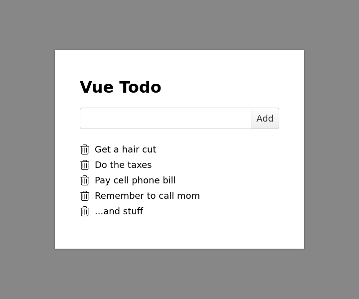

# Vue Mongo Todo

This is a really simple real time todo app built with Node, Vue, and MongoDB.



### Requirements

The following are required by this app and must be install on your machine to work.

- [Node.js]
- [MongoDB]

### WebSockets

The [socket.io] library is used to push real time updates to the browser.
Reminders are synced with the use of [socket.on] to listen for events on the client, and [socket.emit] to push events from the server.

### Install

This will install all required dependencies for the server to run.

```bash
npm install
```

### Start Server

This will start both the database and web server.

```bash
npm start
```

You can now access the app on the localhost domain: [localhost:8080](http://localhost:8080/).
The server will also bind to all available addresses,
so if you wish to access the app across a network,
use the local ip address of the machine running the server.

```bash
ip addr show
```

It will look something like `192.168.1.xxx`

[Node.js]: https://nodejs.org/en/download/
[MongoDB]: https://www.mongodb.com/download-center#community
[socket.io]: https://socket.io/
[socket.on]: https://socket.io/docs/server-api/#socket-on-eventname-callback
[socket.emit]: https://socket.io/docs/server-api/#socket-emit-eventname-args-ack
